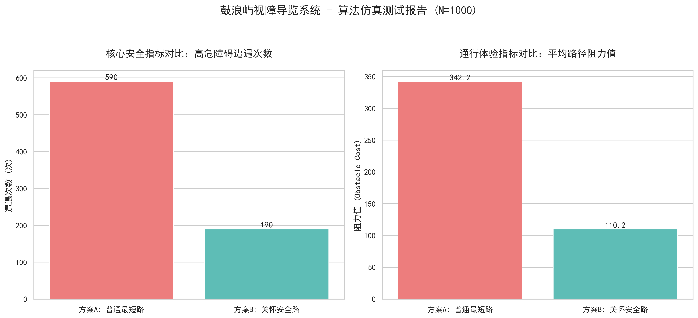
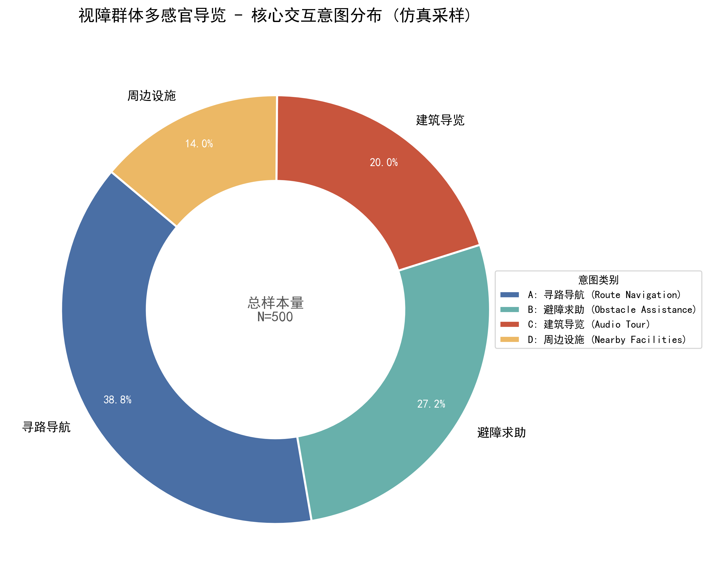
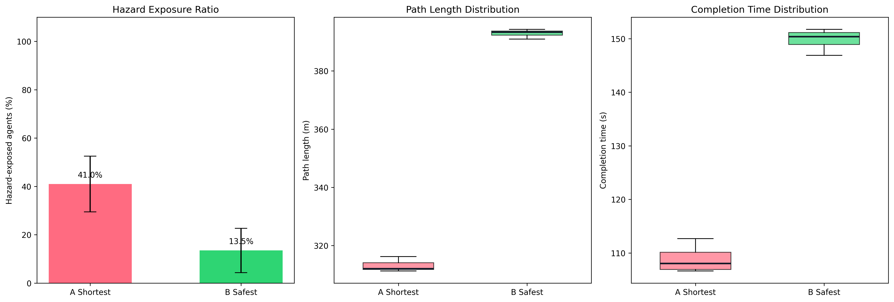
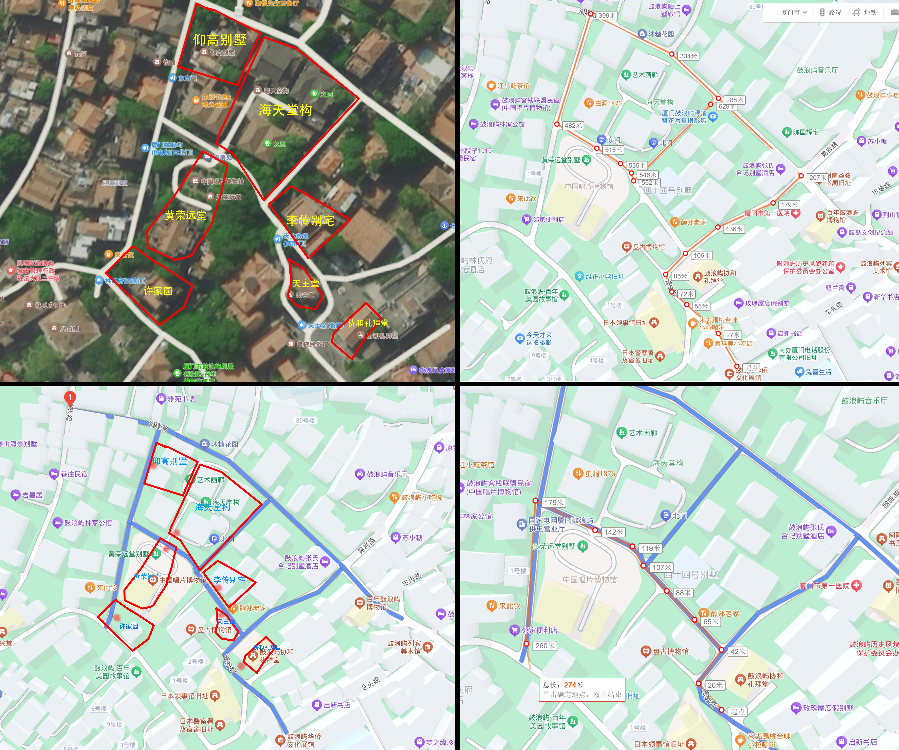

# Hearing Gulangyu

Context-aware AI Accessible Guide & Digital Twin Validation System

## 中文项目简介

**听见鼓浪屿** 是一个面向历史街区游览与无障碍导航的 AI 空间体验产品原型。项目将游客语音 / 文本 / 图片提问、当前位置、用户类型、地图节点、坡度 / 路面风险和文化遗产知识结合起来，形成一个 context-aware AI guide workflow。

它不是普通旅游聊天机器人，而是一个以空间上下文为约束的 AI 导览与路径辅助系统：AI 负责理解问题、纠正语音、组织导览回答；路径算法负责风险评分和路线选择；Unity 数字孪生与评估图表用于验证路线安全性和体验效果。

**项目关键词：** 空间智能、无障碍导航、Context-aware AI Guide、Workflow、数字孪生验证。

Hearing Gulangyu is a completed cross-disciplinary project that combines a context-aware AI guide, accessibility-oriented navigation app, Unity-based digital twin simulation, route-risk modeling, sensory heritage mapping, and evaluation charts for Gulangyu Island.

This repository is a public-safe flagship showcase. It is not the full private project archive and does not include raw data, deployment files, database files, environment variables, internal academic documents, or complete Unity/App source trees.

## Product Positioning

This project should be understood as an **AI-assisted spatial experience product**, not only a cultural tourism app. The AI layer is designed around site context:

```text
visitor voice / text / photo + location + user profile + map context
-> AI interpretation and correction
-> route-risk algorithm and site knowledge grounding
-> accessible guide answer, route suggestion, or warning
-> Unity digital twin validation and human design iteration
```

The product value is that AI responses are not generic chat. They are constrained by Gulangyu's map, heritage points, route risk model, user type, and accessibility needs.

## Why This Project Matters

Historic heritage sites are often difficult to navigate for elderly visitors, visually impaired users, wheelchair users, and first-time tourists. Gulangyu Island adds another layer of complexity: dense alleys, slopes, changing pavements, heritage buildings, crowd flows, and sensory memory.

This project explores how digital navigation can move beyond shortest-path routing and become a more inclusive spatial experience.

## What I Built

- A context-aware AI guide workflow for voice, text, and photo-based visitor questions.
- A navigation logic prototype for accessibility-aware route selection.
- A graph-based routing engine using slope, friction, distance, and user profiles.
- A site-grounding layer that connects AI responses with map points, route context, and sensory heritage notes.
- A voice correction workflow to improve AI interaction for tourists and accessibility scenarios.
- A Unity digital twin simulation with a digital cane, hazard zones, route following, and exposure counting.
- Sensory and heritage-mapping assets for site storytelling.
- Evaluation figures comparing route behavior, hazard exposure, completion time, and algorithm performance.
- A portfolio-ready system narrative connecting app, simulation, and research workflow.

## AI Product Loop

| Product layer | Current role |
| --- | --- |
| Input | Visitor voice, text, photo, current location, destination, user type |
| AI interpretation | Speech correction, intent recognition, photo/question interpretation, guide response drafting |
| Spatial grounding | Map nodes, heritage points, sensory notes, route-risk weights, accessibility constraints |
| Algorithmic decision | Route weighting by distance, slope, friction, and user profile |
| Output | Guide answer, route suggestion, turn instruction, accessibility warning, heritage explanation |
| Validation | Unity route-following simulation, hazard exposure counting, A/B evaluation figures |
| Feedback | User re-asks, route preference changes, designer adjusts weights and context prompts |

## Repository Map

- `docs/` - project narrative, system architecture, privacy notes, and release notes
- `assets/figures/` - selected public-safe charts and visual materials
- `code_samples/backend/` - selected Python routing/simulation samples
- `code_samples/unity/` - selected Unity C# simulation samples

## Selected Figures

### Accessibility Routing Comparison



### Intent Distribution



### Evaluation Summary



### Gulangyu Map



## Technical Highlights

- Context-aware AI guide workflow connecting API-based interaction with map and route context.
- Voice correction and intent routing for more robust tourist-AI interaction.
- Photo-question flow for visual visitor problems and guide assistance.
- Multi-profile route weighting for normal, elderly, disabled, and blind-user scenarios.
- Route weights combining distance, slope, surface friction, and accessibility constraints.
- Direction and turn-instruction logic for navigation guidance.
- Unity ray-based digital cane prototype for hazard detection.
- Hazard exposure metrics for evaluating route safety.
- Public-safe chart set for communicating results without exposing raw data.

## Product Documents

- [AI product flow diagram](docs/AI_PRODUCT_FLOW_DIAGRAM.md)
- [AI product flow](docs/AI_PRODUCT_FLOW.md)
- [Context-aware AI guide](docs/CONTEXT_AWARE_AI_GUIDE.md)
- [Voice and photo interaction](docs/VOICE_PHOTO_INTERACTION.md)
- [Routing and validation metrics](docs/ROUTING_AND_VALIDATION_METRICS.md)
- [中文用户研究摘要](docs/USER_RESEARCH_SUMMARY_CN.md)
- [中文 RAG / Workflow 架构说明](docs/RAG_WORKFLOW_ARCHITECTURE_CN.md)
- [Interview talking points](docs/INTERVIEW_TALKING_POINTS.md)

## Code Samples

Backend:

- [`graph_engine.py`](code_samples/backend/graph_engine.py)
- [`simulation.py`](code_samples/backend/simulation.py)

Unity:

- [`DigitalCane.cs`](code_samples/unity/DigitalCane.cs)
- [`RouteFollower.cs`](code_samples/unity/RouteFollower.cs)
- [`HazardZone.cs`](code_samples/unity/HazardZone.cs)
- [`DynamicHazardObstacle.cs`](code_samples/unity/DynamicHazardObstacle.cs)

These are selected samples for review. They are not a full runnable production package.

## Privacy And Safety

This public repository intentionally excludes:

- `.env` files and deployment configuration
- SSH keys, tokens, passwords, API keys, and database credentials
- raw databases, user samples, CSV data, and private logs
- ngrok/public demo URLs
- teacher/advisor/team/internal academic materials
- full paper drafts and submission materials
- Unity `Library`, `Temp`, `Obj`, and `Logs`
- complete raw APP and Unity project archives

See [`docs/public_release_notes.md`](docs/public_release_notes.md) for details.

## Status

Completed project, public-safe flagship showcase release.

The full private archive is stored offline and is not published.
