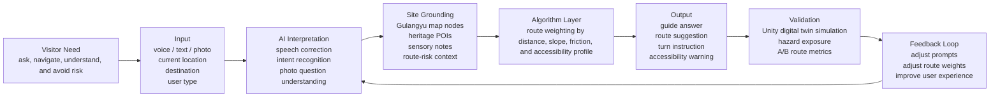

# AI Product Flow Diagram

This diagram explains Hearing Gulangyu as a context-aware AI guide product, not simply an app with a chatbot.

## Product Manager Reading

- **User problem:** Heritage-site visitors need safer and more context-aware guidance than generic map routing.
- **AI role:** Interpret multimodal visitor questions and ground responses in site context.
- **Algorithm role:** Select safer routes using accessibility and risk weights.
- **Validation:** Unity simulation and evaluation figures test whether the route and warning logic improve experience.
